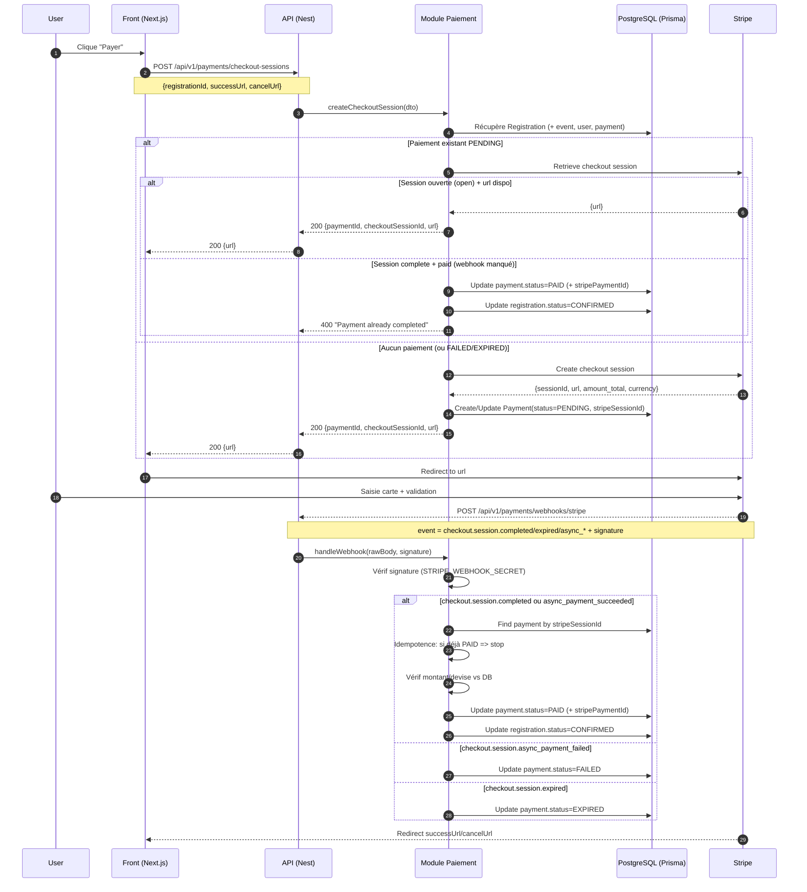

# Paiement (Stripe Checkout)

- Permettre à un utilisateur de payer une inscription à un événement payant via **Stripe Checkout**.
- Enregistrer l’état du paiement en base (statuts) quand Stripe confirme le paiement.

## Schéma de flux (version implémentée)

## Endpoints

### Créer une session de paiement

- **POST** `/api/v1/payments/checkout-sessions`
- Body:
    - `registrationId`: id de l’inscription
    - `successUrl`: URL de retour en cas de succès (front)
    - `cancelUrl`: URL de retour en cas d’annulation (front)
- Réponse: `{ paymentId, checkoutSessionId, url }`

**Comportements importants**

- Si un paiement existe déjà en `PENDING`, l’API tente de **réutiliser** la session Stripe tant qu’elle est encore `open`.
- Si Stripe indique que la session est `complete` et `paid` (cas webhook manqué), on **resynchronise** la base.
- Si l’événement est gratuit (`isFree` / `price <= 0`), la création est refusée.

### Webhook Stripe

- **POST** `/api/v1/payments/webhooks/stripe`
- Particularité: **body RAW** (Buffer) requis pour vérifier la signature Stripe.

## Middleware "raw body” (obligatoire pour Stripe)

Stripe signe le payload. Si Nest/Express parse le JSON, la signature ne correspond plus.

La route webhook est configurée pour recevoir le body brut:

- Middleware `bodyParser.raw({ type: 'application/json' })` sur:
    - `/api/v1/payments/webhooks/stripe`

Référence: `apps/api/src/main.ts`

## Modèle de données (résumé)

- `Payment` est lié 1–1 à `Registration`
- Statuts supportés:
    - `PENDING` (session créée, paiement en cours)
    - `PAID` (Stripe confirmé)
    - `FAILED` (paiement échoué)
    - `EXPIRED` (session expirée)
    - `REFUNDED` (prévu côté modèle, pas encore géré par webhook)

## Vérifications mises en place

- **Signature webhook**: vérification via `STRIPE_WEBHOOK_SECRET`
- **Idempotence**: si le paiement est déjà `PAID`, on ne re-traite pas
- **Cohérence montant/devise**: compare `amount_total`/`currency` Stripe avec `Payment.amount`/`Payment.currency`

## Variables d’environnement

- `STRIPE_SECRET_KEY`: clé Stripe secrète (obligatoire)
- `STRIPE_WEBHOOK_SECRET`: secret de webhook (obligatoire)
- `FRONTEND_URL`: utilisé pour CORS (et recommandé pour dériver success/cancel côté serveur)
